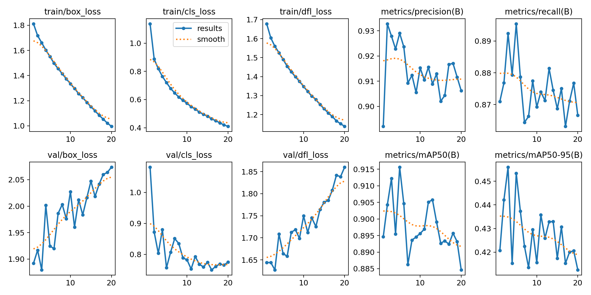
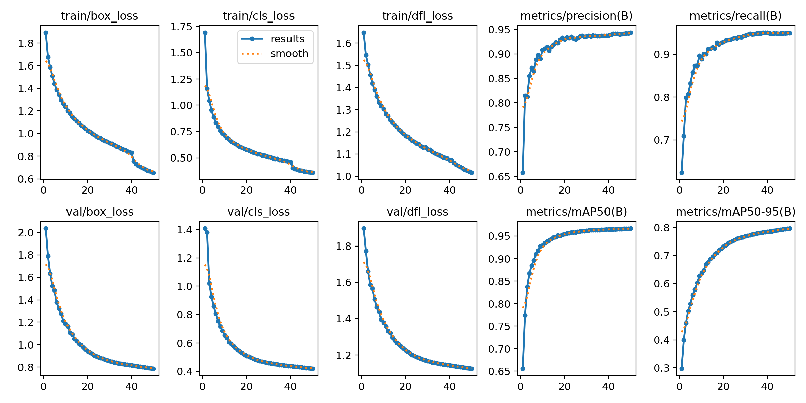

# The Trauma THOMPSON Challenge 2025
Trauma TeleHelper for Operational Medical Procedure Support and Offline Network <br>
for more info please refer to the official website of the grand challenge: [link](https://t3challenge25.grand-challenge.org/t3challenge25/) <br>
<br>
**Please Refer to DISCLAIMER section for the intention of this
## Objective
The Trauma THOMPSON Challenge 2025 aims to drive innovation in AI-assisted remote instruction systems that can provide real-time guidance to frontline providers during high-stakes and lifesaving procedures. The dataset is available for download with the consent of authors [here](https://t3challenge25.grand-challenge.org/data/). I by all means have no rights nor am I authorised to distribute the data or expose the dataset.

## Tasks
Full description of the task is available from the official [website](https://t3challenge25.grand-challenge.org/task/).
- Task 1: Action recognition and anticipation of regular and just in-time procedures
- Task 2: Emergency procedure hand tracking
- Task 3: Emergency procedure tool detection
- Task 4: Realism assessment [ Out of Domain ]
- Task 5: Visual Question Answering

## Disclaimer 
This repository is intended solely for **personal practice and experimentation**. <br> 
The implementations within serve as a test ground for exploring and reproducing state-of-the-art models, algorithms, and training workflows for medical related videos. 
<br>
<br>
Please note:

- Model performance, metrics, and evaluation results are not optimized and should not be considered indicative of the true potential of the referenced methods.

- Training and inference speed may be suboptimal, as the focus is on understanding and experimenting rather than production-grade efficiency.

- Code structure and features may evolve rapidly as part of the learning process.

Use this repository as a reference **at your own discretion**. It is not intended for deployment, benchmarking, or direct comparison with official implementations.

# Glossary
## Setup
```
uv init trauma_thompson --python 3.12
uv pip install requirements.txt   
```

## Hardware Specs
| Component | Specification |
|------------|----------------|
| CPU | Intel Core i7-14700K |
| GPU | NVIDIA RTX 5090|
| RAM | 64 GB |
| OS | Ubuntu 24.04 LTS |
| CUDA | 12.8 |

## Models
|        | Model    | Task                 | Source      |
|--------|----------|----------------------|-------------|
| Task 1 | V-JEPA2   | Video Classification | [Meta FAIR](https://github.com/facebookresearch/vjepa2)|
| Task 2 | YOLOv11n | Object Detection     | [Ultralytics](https://docs.ultralytics.com/modes/track/)|
| Task 3 | YOLOv11n | Object Detection     | [Ultralytics](https://docs.ultralytics.com/tasks/detect/)|
| Task 5 | Qwen3-VL | VQA                  | [Unsloth](https://docs.unsloth.ai/models/qwen3-vl-how-to-run-and-fine-tune)|

# Results
## Task 1 - Action Recognition 
Ultilised V-JEPA2 as frozen backbone for video feature extraction and fine-tune a classifier head for video classification task. <br>
Due to time constraint and computation cost, hyperparameter optimisation for this task could be better.  <br>
<br>
### Training parameters are as below:
```
epochs: 20
batch_size: 64
num_workers: 4
learning_rate: 0.0001
optimiser: AdamW
num_classes: 124
pretrained_model_weights: facebook/vjepa2-vitl-fpc16-256-ssv2 
```
|        | Value    | 
|--------|----------|
| Training Time | approx 20 hours | 
| Best Validation Accuracy | 50.06% |
<br>
<p align="center">

</p>

## Task 2 - Hand Tracking
Utilised [Ultralytics](https://docs.ultralytics.com/modes/track/) YOLOv11n for object detection training and infer using Ultralytics's object tracking method. The provided dataset consisted of annotations that are not suitable for training (refer to task2 subfolder EDA section for more info) and was subsequently removed from the training and validation set. <br> 
For some results, the training results for single class object detection is not great.
<p align="center">
<br>
</p>
<p align="center">

</p>


## Task 3 - Tools Detection
Utilised Ultralytics framework YOLOv11n for quick prototyping of object detection training. Dataset spllits can refer to task3 subfolder EDA section.
<p align="center">
<br>
</p>
<p align="center">

</p>
